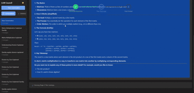
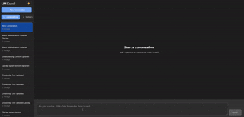
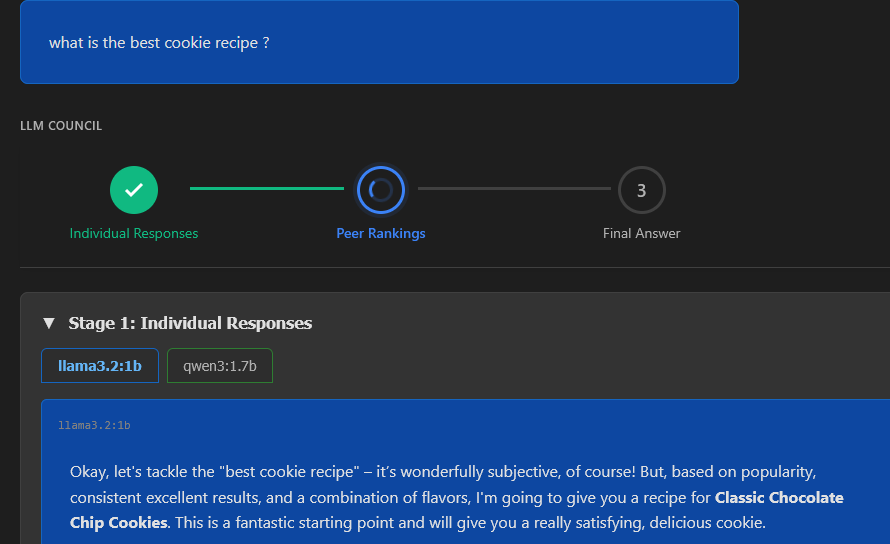
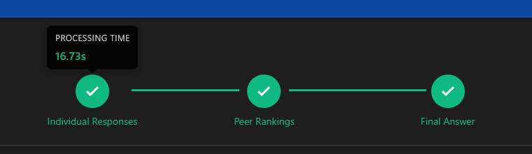
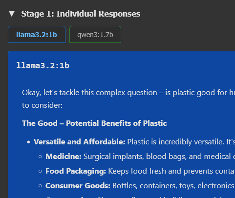
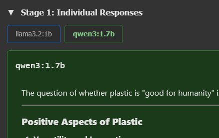
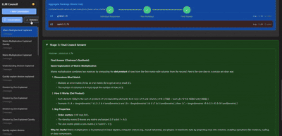
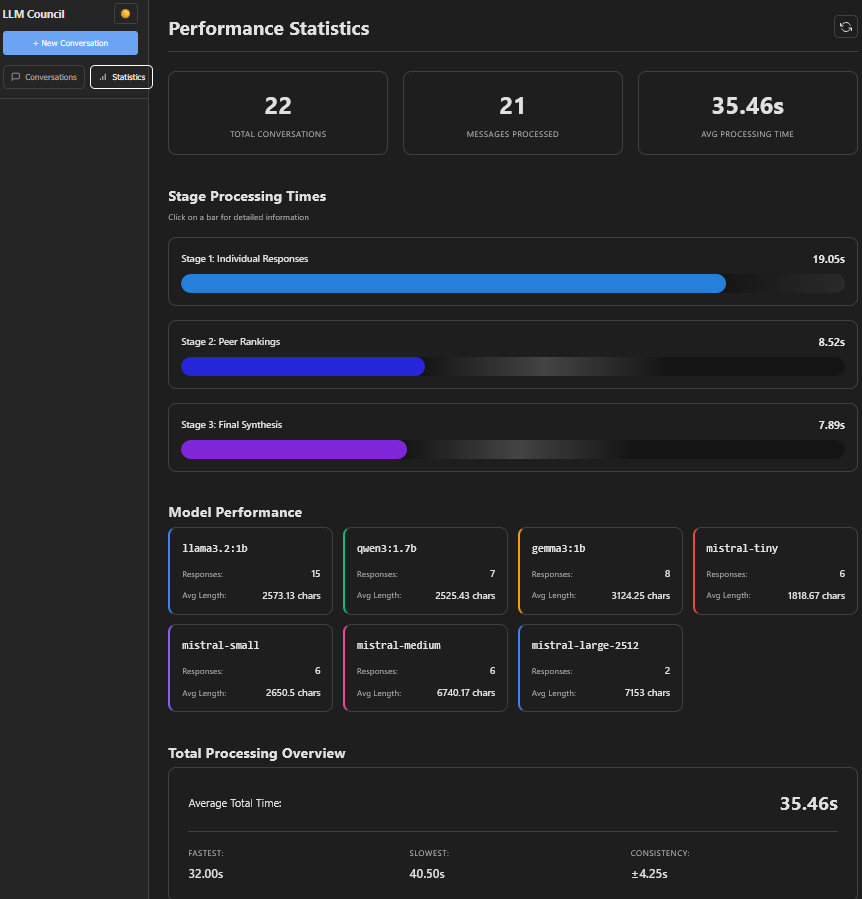

# LLM Council - Local Deployement

### Team
- **Group Members**:
    - Aymeric MARTIN
    - Noémie MAZEPA
    - Lorrain MORLET
- **TD Group**: CDOF3

--- 

### Project Overview
This project is a local and distributed implementation of the LLM Council concept created by Andrej Karpathy (https://github.com/karpathy/llm-council). Instead of relying only on a single LLM, several LLMs are used to answer a query through a process made of three steps.

In the original implementation, the LLM models used for the council members and chairman were all models called via cloud-based APIs. 
The objective of this project is to refactor the LLM Council code so that everything runs locally. Each council member and the chairman are executed as independent services, on separate machines and communicate with the backend via REST APIs. This setup aims for a distributed architecture across multiple machines.

The three main stages are: 
- **First Opinions**: several LLMs answer the user query independently.

- **Review & Ranking**: each model reviews and ranks the anonymized answers.

- **Chairman Synthesis**: a dedicated Chairman LLM synthesizes all answers and rankings into a final answer.

The user has access to all of the intermediate outputs and can observe how the final answer is constructed.



---

### System Architecture
- All LLMs run locally using Ollama

- Each LLM runs as an independent server exposing REST API endpoints

- One machine hosts the main backend and the Chairman LLM

- Other machines host the council member LLMs

- All machines must be connected to the same network

- Communication between machines is done via HTTP requests on a fixed port

The backend coordinates the full council workflow and the frontend visualizes each stage of the process.

---

### LLM Models Used
- Council Member 1: Gemma3 (1B)
- Council Member 2: Gemma3 (4B)
- Chairman: Ministral-3 (3B)

### Setup and Installation
#### Prerequisites
- Python 3.10+
- Node.js and npm
- Ollama installed on all machines
- All machines connected to the same network
- Firewall configured to allow communication on the required port (ex: 8002)

#### Network and Firewall Configuration

Since the LLM Council runs in a distributed configuration, all machines must be able to communicate with each other over the network.

Each machine needs to allow **incoming connections** on the port used by the LLM servers (in this project, port **8002**, but it can be changed if needed).

To do this, a new **firewall rule** needs to be created on each machine:
- The rule must allow **inbound traffic**
- The protocol should be **TCP**
- The allowed port should match the server port (default: `8002`)
- The rule should apply to the local network

This configuration allows the main backend to send HTTP requests to the council member servers and receive their responses. Without this step, the machines will not be able to communicate correctly.

All machines must also be connected to the same network (for example, a shared Wi-Fi network or a phone hotspot).


### Ollama Setup
On each machine, install Ollama and pull the required models:
````
ollama pull qwen2.5:1.5b
ollama pull ministral:3b
````
--- 
### Running the Project

#### Create and Activate a Virtual Environment

First, create a Python virtual environment named .venv.
For Windows:
````
python -m venv .venv
.venv\Scripts\Activate.ps1
````
#### Install Dependencies Using uv
Once the virtual environment is activated, install uv:
````
pip install uv
uv sync
````
This will install all required Python packages defined for the project.

#### Start the LLM Servers
1. Chairman Machine

Terminal 1 (Backend):
```bash
uv run python -m backend.main
```

Terminal 2 (Chairman Server):
```bash
uv run python -m backend.chairman_server
```

Terminal 3 (Frontend):
```bash
cd frontend
npm install
npm run dev
```
Then open http://localhost:5173 in your browser.

2. Council Member 1 Machine
```bash
uv run python -m backend.council_server_1
```
3. Council Member 2 Machine
```bash
uv run python -m backend.council_server_2
```

---
## Technologies Used

- **Backend:** FastAPI (Python 3.10+), async httpx, Ollama
- **Frontend:** React + Vite, react-markdown for rendering
- **Storage:** JSON files in `data/conversations/`
- **Package Management:** uv for Python, npm for JavaScript

---
### Improvements Over the Original Project
- Full local execution without cloud APIs
- Distributed architecture using REST APIs
- Separation of council members and chairman into independent services

- Enhanced frontend with:
    - Light/Dark mode:

    
    
    - Workflow visualization:

    
    

    - Improved tab view for responses:

    
    


    - Model performance dashboard:

    
    

---
### Generative AI Usage Statement
- **Technical report**: ChatGPT was used to rephrase and improve the structure of some sections. All of the content and technical ideas were written by the team.

- **Code**: Generative AI tools (ChatGPT, Mistral, and GitHub Copilot) were used to assist with frontend development and to better understand REST API communication and distributed architecture concepts.

- **Documentation**: ChatGPT was used to help structure and write this README.md based on the technical report and project details.
